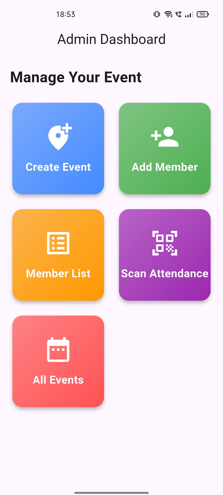

# LedgerAttend
### Modernizing Campus Operations through Geofencing & Automation

**LedgerAttend** is a multi-tenant SaaS platform designed to eliminate the administrative friction of running college organizations. It replaces manual, unreliable paperwork with a secure, digital-first ecosystem.

---

## The Problem Statement
College clubs and student chapters currently face three major pain points:
1. **Proxy Attendance:** Standard sign-in sheets allow students to mark attendance for absent friends, compromising event integrity.
2. **Administrative Fatigue:** Manually tracking finances and verifying participation for hundreds of students is time-consuming and prone to error.
3. **Delayed Recognition:** Delivering participation certificates often takes weeks due to manual data entry and distribution.

**LedgerAttend** solves this by using location-based validation and automated cloud workflows to ensure every record is accurate and every certificate is instant.

---

## Planned Features
* **Geofenced Check-in:** Uses high-precision GPS logic to ensure students are physically present at the venue.
* **Auto-Certify:** Instant generation and delivery of participation certificates via Firebase Cloud Functions.
* **Digital Ledger:** A simplified, transparent financial tracker for club fees and event spending.
* **Multi-Tenancy:** A single platform that allows multiple college clubs to manage their data in isolated, secure silos.

---

---

## App Screenshots

| Admin Dashboard | Add Member | Create Event |
| :---: | :---: | :---: |
|  |  |  |
| **Admin Dashboard** | **Add Member** | **Create Event** |

---

## Proposed Tech Stack
* **Frontend:** Flutter (Android & iOS)
* **Backend:** Firebase (Auth, Firestore, Cloud Functions)
* **API:** Google Maps/Location Services

---

## Idea Credit
This project concept was developed in collaboration with **Gemini (Google AI)**, designed to be a high-impact project for the Indian student developer ecosystem.

---

## Connect With Me
I am a student developer passionate about building tech that solves real-world problems. Let's connect!

* **GitHub:** [github.com/sundramdotdev](https://github.com/sundramdotdev)
* **LinkedIn:** [linkedin.com/in/sundramdotdev](https://linkedin.com/in/sundramdotdev)

---
*Built to make campus life more efficient, one check-in at a time.*
